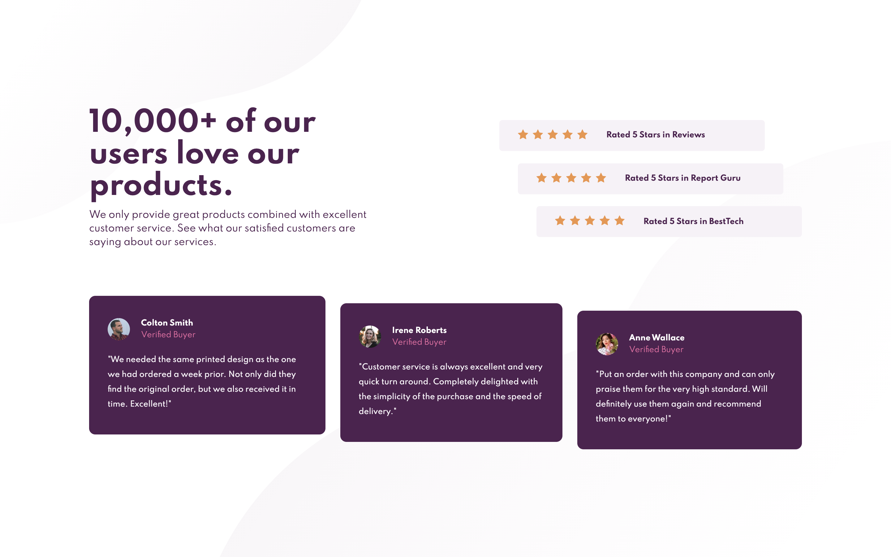

# Frontend Mentor - Social proof section solution

This is a solution to the [Social proof section challenge on Frontend Mentor](https://www.frontendmentor.io/challenges/social-proof-section-6e0qTv_bA). Frontend Mentor challenges help you improve your coding skills by building realistic projects.

## Table of contents

- [Overview](#overview)
  - [The challenge](#the-challenge)
  - [Screenshot](#screenshot)
  - [Links](#links)
- [My process](#my-process)
  - [Built with](#built-with)
  - [What I learned](#what-i-learned)
  - [Continued development](#continued-development)
  - [Useful resources](#useful-resources)
- [Author](#author)

## Overview

### The challenge

Build out the social proof section and get it looking as close to the design as possible.

Users should be able to:

- View the optimal layout for the section depending on their device's screen size

### Screenshot



### Links

- Solution URL: [Add solution URL here](https://your-solution-url.com)
- Live Site URL: [Add live site URL here](https://your-live-site-url.com)

## My process

### Built with

- Semantic HTML5 markup
- Flexbox

### What I learned

I learned em which is another unit for length. It depends on the font size. I used em unit a lot in this challenge. The default font size is set to 15px.

### Continued development

Still struggling with getting right values for width and height. I'd also like to learn more about when it's appropriate to use px, %, em, etc. I was able to set the bottom background pattern to the bottom right corner for desktop mode using

```css
background-position: right bottom;
```

but the same property didn't work when max-width was 375px for mobile mode.

## Author

- Frontend Mentor - [@lahn0528](https://www.frontendmentor.io/profile/lahn0528)
